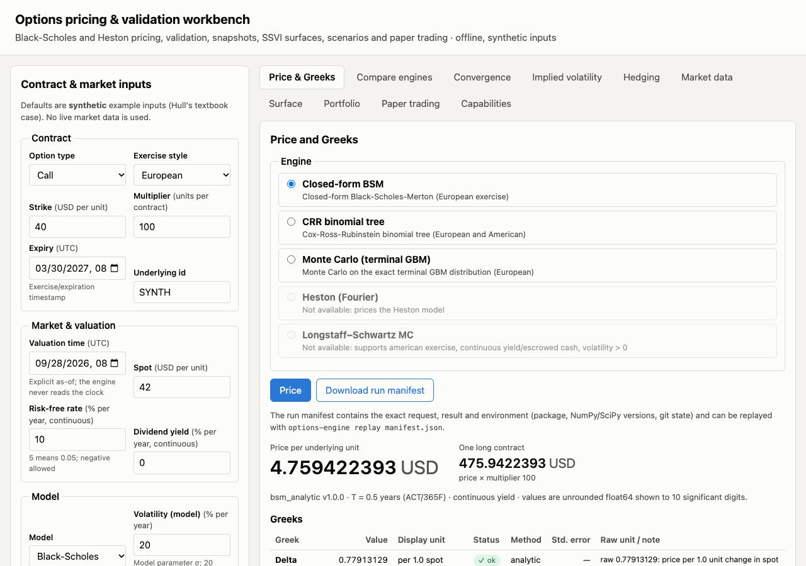
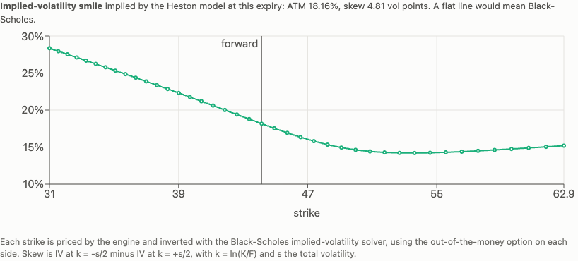
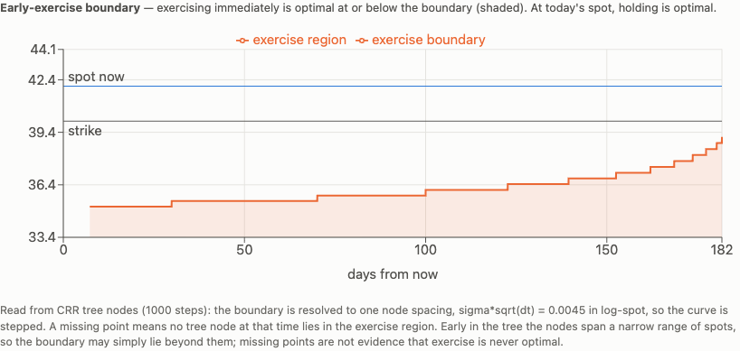
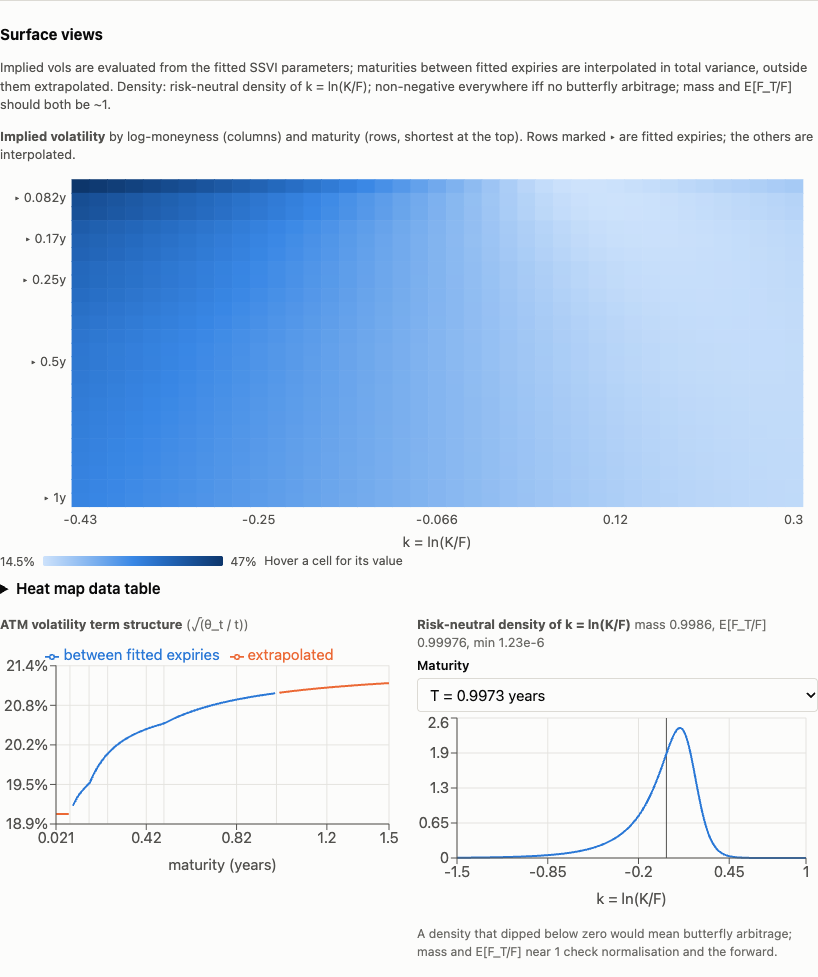
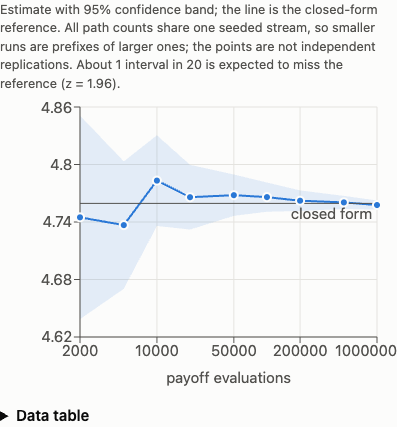
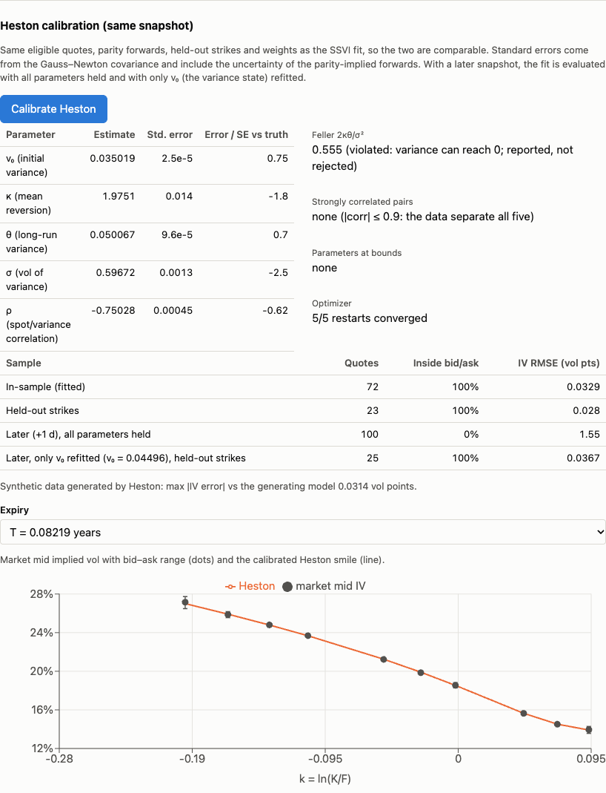
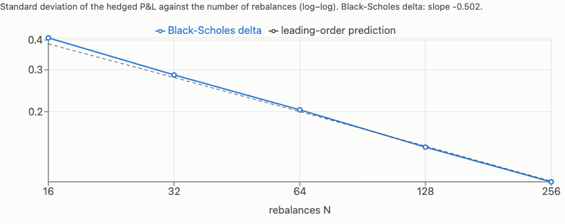
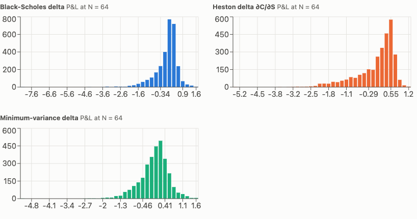

# Options Pricing & Model-Validation Workbench

A reproducible workbench for pricing vanilla options and, more importantly, for showing how
far each number can be trusted. Every result carries its assumptions, numerical method,
per-Greek status, uncertainty and a hash that lets it be replayed.



## Highlights

- **Five pricing engines behind one capability-checked interface:** closed-form
  Black–Scholes–Merton, CRR binomial tree (European/American, cash dividends), terminal Monte
  Carlo with variance reduction, **Heston stochastic volatility** by Fourier inversion, and
  **Longstaff–Schwartz** least-squares Monte Carlo for American exercise.
- **Validation against independent references, with acceptance criteria written down first.**
  QuantLib 1.43 and 60-digit mpmath fixtures, analytic limits, identities, statistical coverage
  tests and fault injection. Every tolerance lives in `config/validation_policy.toml`, and its
  SHA-256 was logged in `docs/progress.md` *before* the code it gates existed. One predeclared
  criterion that turned out to be mathematically wrong is corrected in the open, with reasons.
- **Measured, not claimed:** Heston prices agree with QuantLib to 1.8e-10 over 200 cases (two
  of the four parameter sets violate the Feller condition); Longstaff–Schwartz stays within
  predeclared bounds of an exact Bermudan tree on 26 cases, its standard error is calibrated
  (spread of 200 independent runs / mean reported SE = 1.00), and an Andersen–Broadie dual
  upper bound brackets the price from above.
- **Calibration with honest uncertainty:** Heston is fitted to snapshot quotes with standard
  errors that include the uncertainty of the parity-implied forwards. Leaving that term out put
  one parameter 4 SE from the truth on synthetic data; with it, all are within 2.5 SE. The next
  day, the full parameter set prices 0% of quotes inside bid/ask, while refitting only the
  variance state brings it back to 100%.
- **Hedging experiment:** delta hedging reproduces discrete-hedging theory (error ∝ N^−1/2,
  within 0.2% of the leading-order Gamma formula). Under Heston, the minimum-variance delta
  beats both the Heston delta and the Black–Scholes delta.
- **Tested on real data:** a mapped CSV importer for broker/vendor chain exports, and a two-day
  study of four models (SSVI, Heston, per-expiry SVI, Heston with a θ term structure) whose
  metrics were fixed before the code existed. On real SPX options, SVI slices fit 6.5× better
  than SSVI but are not arbitrage-free (`docs/real-data.md`). The repository ships synthetic
  data only.
- **Engineering:** layered architecture (domain → models → engines → application →
  interfaces), strict mypy, 350+ tests (property-based, statistical, mutation, API, CLI), a
  versioned FastAPI API with a bounded process pool and admission control, typed React UI
  generated from the OpenAPI schema, Docker image, CI, replayable run manifests, and 24
  decision records.

| | |
|---|---|
|  |  |
| Heston smile: each strike priced by the Fourier engine, inverted with the BSM IV solver | American put early-exercise boundary extracted from the CRR tree |
|  |  |
| Arbitrage-constrained SSVI surface fitted to synthetic quotes, with its risk-neutral density | Monte Carlo estimate converging inside its confidence band |
|  |   |
| Heston calibration: estimates with standard errors, error vs truth in SE, next-day evaluation, fitted smile | Hedging error falls like N^−1/2 on the leading-order prediction (dashed); under Heston, minimum-variance delta has the narrowest P&L |

Status: **Release A and Release B complete**, plus Heston, Longstaff–Schwartz, calibration,
hedging, duality bounds, real-data import and term-structure models (ADRs 0017–0024). Gates and
evidence: `docs/progress.md`; latest report `reports/release-e/report.md` (34 deterministic checks
and the statistical tier, all passing).

## Quick start (offline, no credentials)

Requirements: [uv](https://docs.astral.sh/uv/) ≥ 0.11, Node ≥ 20 (only to build the UI).

```bash
uv sync                                   # Python 3.13 env from uv.lock
uv run options-engine demo                # both releases, incl. six meaningful failure cases
uv run pytest -q                          # deterministic tier (~30 s, offline)
uv run options-engine validate --out reports/local   # full validation report (~80 s)

cd ui && npm ci && npm run build && cd .. # build the web UI once
uv run options-engine serve               # API + UI on http://127.0.0.1:8000
```

In the UI, switch **Model** to *Heston stochastic volatility* to price under Heston and see the
**implied-vol smile** it generates; choose *American* and the *Longstaff–Schwartz MC* engine for
a regression Monte Carlo price with a confidence interval. Price a contract to see its **value profile** (today, mid-life, near expiry, payoff),
**Greek profiles** across spot and, for American contracts, the **early-exercise boundary**.
Then open **Market data → Load bundled synthetic snapshots** and **Surface → Fit surface** for the
**implied-vol heat map**, **ATM term structure** and **risk-neutral density**, and **Portfolio**
for surface-driven scenario P&L. **Paper trading** records trades you make (or would make) and
tracks their P&L against market marks and the model over time; no real money moves.

Slow tier: `uv run --group reference pytest -m "statistical or reference"` (Monte Carlo
replications and live QuantLib/mpmath fixture reproduction).
Frontend dev: `uv run options-engine serve` and `cd ui && npm run dev` (Vite proxies `/api`).
Browser smoke test: `node ui/e2e/smoke.mjs http://127.0.0.1:8000 <screenshot-dir>` (needs
Google Chrome installed; uses `playwright-core`, no browser download).

## Deployment

One container serves the API and the built UI:

```bash
docker build -t options-workbench .
docker run --rm -p 8000:8000 -v "$PWD/data:/app/data" options-workbench
```

Runtime settings: `OPTIONS_ENGINE_WORKERS` (process-pool size, default 2),
`OPTIONS_ENGINE_MAX_IN_FLIGHT` (admission limit, default 8), `OPTIONS_ENGINE_TIMEOUT_SECONDS`
(client wait, default 30), `OPTIONS_ENGINE_DATA_DIR` (snapshots, fits and paper
ledgers, default `./data`, git-ignored).
Health: `GET /api/v1/health`; counters: `GET /api/v1/metrics`. Verified locally: image builds,
container serves health, pricing and UI as a non-root user.

## CLI

```bash
uv run options-engine price --input examples/price_hull_call.json
uv run options-engine price --as-of 2026-09-28T20:00:00Z --expiry 2027-03-30T08:00:00Z \
    --type put --spot 42 --strike 40 --rate 0.10 --vol 0.20 --engine crr_tree --steps 2000 \
    --manifest run.json
uv run options-engine replay run.json          # recompute; exit 0 only if bit-identical
uv run options-engine compare --input examples/compare_otm_put.json
uv run options-engine price --input examples/price_heston_call.json
uv run options-engine price --as-of 2026-09-29T20:00:00Z --expiry 2027-09-29T20:00:00Z \
    --type put --spot 100 --strike 90 --rate 0.03 --heston 0.04,1.5,0.04,0.3,-0.7
uv run options-engine price --as-of 2026-09-29T20:00:00Z --expiry 2027-09-29T20:00:00Z \
    --type put --exercise american --spot 100 --strike 100 --rate 0.05 --vol 0.2 \
    --engine lsm_american --paths 100000
uv run options-engine iv --input examples/iv_quotes.json
uv run options-engine engines                  # capability matrix
uv run options-engine snapshot ingest fixtures/snapshots/synthetic_day1.json
uv run options-engine snapshot list
uv run options-engine surface fit <snapshot-id> --later <later-snapshot-id>
uv run options-engine heston calibrate <snapshot-id> --later <later-snapshot-id>
uv run options-engine snapshot import-csv examples/csv/synthetic_chain_day1_long.csv \
    --mapping examples/csv/mapping_long.toml --underlying SYNTH-IDX --spot 4500 \
    --as-of 2026-09-28T20:00:00Z --synthetic --ingest     # real exports: docs/real-data.md
uv run options-engine study <day1-snapshot-id> <day2-snapshot-id>
uv run options-engine hedge --rebalances 16,32,64,128,256            # GBM world
uv run options-engine hedge --heston 0.04,1.5,0.04,0.3,-0.7 --strategies bsm,heston,heston_mv \
    --rebalances 8,16,32,64 --paths 3000                            # Heston world
```

## Supported scope

| | Closed-form BSM | CRR tree | Terminal MC | Heston Fourier | Longstaff–Schwartz |
|---|---|---|---|---|---|
| Model | BSM | BSM | BSM | Heston | BSM |
| Exercise | European | European, American | European | European | American (as Bermudan, 50 dates default) |
| Dividends | yield; escrowed cash | yield; escrowed cash | yield; escrowed cash | yield | yield; escrowed cash |
| σ = 0 / at expiry | yes (exact limits) | rejected | rejected | σ_v = 0 → BSM at √(I(T)/T); expiry payoff | rejected |
| Greeks | all six, analytic | Δ, Γ, Θ from nodes; vega, ρ, ρ_q by bump | Δ, vega, ρ pathwise with SE | Δ, Γ, Θ, ρ, ρ_q by bump; vega not supported (no single vol) | not supported (use the tree) |
| Uncertainty | — | odd/even spread (heuristic) | SE + CI from independent observations | quadrature error bound | SE + CI; estimate is low-biased |

- **Heston** (ADR 0017): Lewis single-integral Fourier pricing with the "little trap"
  characteristic function rearranged to stay exact as vol-of-vol → 0; Feller violations
  reported, not rejected; smile view across strikes.
- **Longstaff–Schwartz** (ADR 0018): independent regression and pricing path sets (valid SE,
  low-biased estimate), Brownian-bridge backward path generation (O(paths) memory), basis of
  polynomials in S/K plus the European value, European-payoff control variate with β from the
  regression set.
- **Heston calibration** (ADR 0020): same eligible quotes, forwards and held-out split as SSVI;
  multi-start weighted least squares on a vectorised pricer (ADR 0019); Gauss–Newton standard
  errors plus forward uncertainty (delta method); correlation matrix and identifiability flags;
  next-day evaluation held fixed and with v0 refitted.
- **Hedging experiment** (ADR 0021): GBM or Heston (Andersen QE) worlds; Black–Scholes, Heston
  and minimum-variance deltas; P&L statistics and histograms for several rebalancing
  frequencies, with the leading-order theory on the same paths.
- **Duality bound** (ADR 0022): optional Andersen–Broadie upper bound for Longstaff–Schwartz,
  reported as a price bracket and a duality gap.
- **Real-data import** (ADR 0023): mapped CSV import (long or straddle layout, timezones, DST)
  into the snapshot format, then quality checks, fits and the two-day study.
- **Implied volatility:** European BSM; bracketed Brent with bound checks, residual test and a
  quote-resolution stability check; bid and ask inverted separately. American quotes rejected.
- **Market snapshots:** documented JSON format, immutable content-addressed store, 15 quarantine
  reasons and 2 flags, counts per reason; unknown metadata stays unknown.
- **Surface:** SSVI (power-law φ) fitted in price space to European quotes with parity-implied
  forwards, held-out strikes, optional later-snapshot evaluation, immutable artifacts
  (including failed fits). Static-arbitrage freedom is *guaranteed for the parametric surface*
  under stated conditions and *checked on a sampled grid* separately.
- **Visualisations** (all numbers computed by the engines, never in the browser): value and
  Greek profiles against spot; American early-exercise boundary from the CRR tree; implied-vol
  heat map, ATM term structure and risk-neutral density of a fitted surface; convergence, CI,
  smile and P&L heat-map views. Checked against independent routes: the closed-form density
  matches Breeden–Litzenberger differentiation of Black prices, integrates to 1 with E[F_T/F] = 1,
  and the exercise boundary approaches the perpetual-put limit K·2r/(2r+σ²).
- **Paper trading** (no real money moves; not investment advice): accounts with starting cash,
  trade entry, exact-decimal average-cost accounting with fees, marks to market prices and/or
  the model (model-vs-market gap recorded), expiry settlement, P&L history chart, and an
  append-only hash-chained audit log with visible voids. See ADR 0016.
- **Portfolio:** signed positions, one underlying and currency, full repricing over spot/vol/
  rate/time grids, sticky-strike or sticky-moneyness (from a fit), expiry settlement, Greek
  attribution with an unexplained residual.

Conventions (ACT/365F from timestamps, decimal annual rates, per-unit prices, Greek units):
`docs/conventions.md`.

## Measured results

From `reports/release-b/report.md` (Apple M4, NumPy 2.5.3, SciPy 1.18.1) unless noted.

- Closed-form price vs an independent 60-digit mpmath implementation over a 332-case stress
  matrix: max abs error 1.1e-13; 3,850-point normalised-price grid: max relative error 1.8e-12.
- Analytic Greeks vs high-precision numerical derivatives: max abs error 4.6e-13; vs QuantLib
  1.43: 6.0e-13.
- CRR (2000/2001 steps) within the predeclared bound k·S·σ·√T/N on all 664 stress runs; CRR
  American (4000 steps) vs QuantLib FD within 1.7e-3 on 192 cases, including cash dividends.
- Monte Carlo: all 60 coverage / bias / SE-calibration tests pass (500 replications each).
- Heston (`reports/release-c`): 200 prices vs QuantLib `AnalyticHestonEngine`, max abs error
  1.8e-10 (tolerance 1e-8 + 1e-7·price); put-call parity 3.6e-15; deterministic-variance limit
  passes on 27 cases incl. κ = 1e-10; median 4.7 ms per price.
- Longstaff–Schwartz (`reports/release-c`): 26 cases vs a CRR tree exercising on the same 50
  dates; all 52 two-sided criteria pass (largest use of an allowance 57%), mean difference −0.27
  SE. SE calibration over 200 independent runs: ratio 1.00 (band 0.8–1.25). Largest
  Bermudan-to-American gap on the matrix: 0.035. Median 0.21 s per price at the default
  100,000 + 50,000 paths.
- Vectorised Heston pricer (`reports/release-d`): vs QuantLib max abs error 4.2e-12 (200 cases);
  vs the adaptive pricer on 540 points of maturity × variance state × moneyness, 2.1e-11;
  analytic dP/dS and dP/dv vs finite differences, 3.8e-7.
- Heston calibration (`reports/release-d`): exact prices → parameters to relative 1e-10; noisy
  synthetic snapshot → 100% held-out containment, 0.03 vol-point error vs the generating model,
  parameter errors −2.5 to +0.8 SE; next day 0% containment held fixed, 100% with v0 refitted
  (v0 = 0.04496, truth 0.045). About 1 s per calibration.
- Hedging (`reports/release-d`, 20,000 paths): slope of log std vs log N −0.491; std at N = 256
  within 0.2% of the leading-order prediction; with a 25% hedge vol in a 20% world, mean P&L
  1.3928 vs the Gamma identity 1.3906 (difference 1.1 SE). Heston world (ρ = −0.7, N = 64):
  P&L std 1.27 (Black–Scholes delta at implied vol), 1.48 (Heston delta), 1.14 (minimum-variance
  delta); paired z = 44.
- Andersen–Broadie bound (`reports/release-d`, 1,500 outer × 500 inner paths, 25 dates): valid
  and within the predeclared gap on all 6 cases; U − B between −0.024 and +0.078. For one case,
  U − B = 0.28, 0.069 and 0.004 at 125, 500 and 2000 inner paths: the gap is simulation noise,
  not a poor exercise rule.
- **Real data** (SPXW, 14–15 Sep 2022, free sample from
  [HistoricalData.net](https://historicaldata.net/); data not included in the repository):
  held-out bid/ask containment SSVI 15.9%, Heston 6.9%; next day without refit 10.7% / 6.2%.
  Both miss by 2–4 vol points (7–8.5 under one week) against bid–ask widths of 0.13–0.33 vol
  points, so global constant-parameter models are too rigid for SPX. Follow-up (ADR 0024):
  per-expiry SVI slices cut the held-out error to 0.52 vol points (next day 0.91) but cross
  (95 butterfly, 336 in-range calendar violations); a θ term structure leaves Heston unchanged
  (3.99), showing that the misfit is smile shape, not term structure. Details in
  `docs/real-data.md`.
- Surface on synthetic snapshots with a known generating surface: held-out bid/ask containment
  100% (25 quotes each), max IV error vs truth 2.2e-4 (gate 5e-3), no sampled arbitrage
  violations. With the surface held fixed, the next-day snapshot (1 vol point lower, spot +1%)
  is priced inside bid/ask for 0% of quotes — the expected sign that in-sample fit says little
  about the next day.
- Performance, before/after at comparable accuracy:
  - Vectorised cancellation fallback in the BSM kernel: 1 M mixed options 1.52 s
    (`reports/release-a`) → 0.30 s, accuracy checks unchanged.
  - Antithetic + control variate vs plain MC at equal 95% CI half-width (≈0.01): 29× faster in
    both saved reports.
  - Exact terminal sampling vs a 252-step simulation, same accuracy per path: 27× and 58× in the
    two saved reports (the time-stepped baseline itself varied between runs).
- BSM price + 6 Greeks: 36–38 µs per call (median). Portfolio worst cases at the work limits:
  6.8–8.4 s (`reports/post-review`, after the code-review changes; 10.5–14.0 s before).

These describe the tested matrix, synthetic data and one machine; they are not general accuracy,
speed or real-market reliability claims.

## Documentation

- `docs/architecture.md` — components, dependency boundaries, data flow
- `docs/conventions.md` — definitions and units
- `docs/validation.md` — references, stress matrix, tolerances, statistical methods, Release B evidence
- `docs/real-data.md` — running the pipeline on your own option-chain exports
- `docs/decisions/` — 24 decision records
- `docs/progress.md` — gates passed, commands run, defects found, next steps

## Limitations

Heston is European-only, and its calibration uses constant parameters (no term structure);
the dual upper bound needs nested simulation, and its gap is dominated by inner-path noise at
moderate budgets; hedging ignores transaction costs; the other engines are flat-volatility GBM (the surface feeds per-position volatilities, not a
local-vol model); escrowed dividend model (not spot-jump); no settlement lag; tree Greeks by bumping are
noisier than analytic ones; worker timeouts do not kill computations (bounded by measured work
limits instead); snapshot data in this repository is synthetic (real exports are imported locally and never
committed); no live data adapter.

## Credits

References: QuantLib 1.43 and mpmath 1.4.1 (pinned, used to generate committed fixtures); Hull's
BSM worked example; Gatheral & Jacquier, "Arbitrage-free SVI volatility surfaces" (2014,
arXiv:1204.0646); Heston (1993); Lewis, "Option Valuation under Stochastic Volatility" (2000);
Albrecher, Mayer, Schoutens & Tistaert, "The Little Heston Trap" (2007); Longstaff & Schwartz,
"Valuing American Options by Simulation" (2001); Andersen & Broadie, "Primal-Dual Simulation
Algorithm for Pricing Multidimensional American Options" (2004); Andersen, "Simple and Efficient
Simulation of the Heston Stochastic Volatility Model" (2008).

README images: `node ui/e2e/screenshots.mjs http://127.0.0.1:8000 docs/images` against a server
with a fresh data directory (synthetic inputs only).
