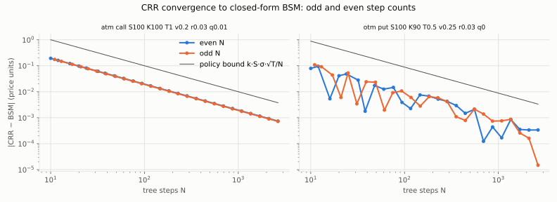
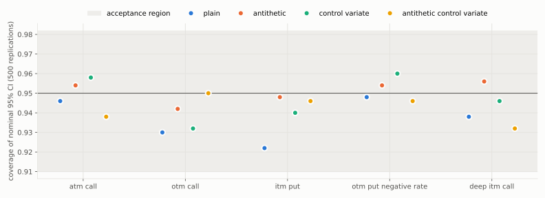
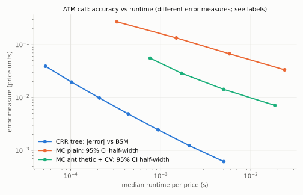
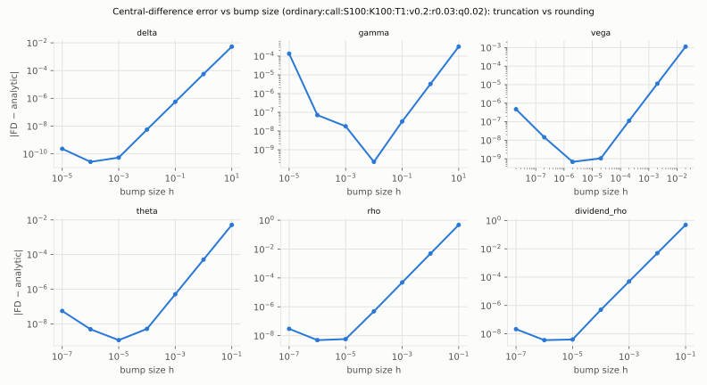

# Validation report

- Generated: 2026-10-01T16:23:58+00:00 (full run)
- Overall: **PASS**
- Code: commit `da26c51762c7421d4ee5116a1472b8df1694385a`, dirty=True, dirty-state sha256 `c06ccbd17feca8c1176cf11a0a050e91e90b617c4569daab8a79a3b03b6c2617` (tracked diff + untracked files under result-affecting paths)
- Lockfile sha256 `ad1bb615f9af281ddfec024f15099200c6dbf05747f12ced3d403b07403c5991`; policy sha256 `c1b9783c1f13a73a2842af14d2958436a6cb8f12e044530b5f0bd4a37a5b640a`
- Platform: macOS-15.6.1-arm64-arm-64bit-Mach-O; CPU Apple M4 (10 logical); Python 3.13.14, NumPy 2.5.3, SciPy 1.18.1, BLAS {'name': 'accelerate', 'version': 'unknown'}
- Thread env: {'OMP_NUM_THREADS': None, 'OPENBLAS_NUM_THREADS': None, 'MKL_NUM_THREADS': None, 'VECLIB_MAXIMUM_THREADS': None, 'NUMEXPR_NUM_THREADS': None}
- Runtime of this report: 145.4 s

## Deterministic gates

| check | result | cases | failed | excluded | max abs error | max scaled error (≤1 passes) |
|---|---|---|---|---|---|---|
| `bsm_price_vs_mpmath` | pass | 332 | 0 | 0 | 1.14e-13 | 0.00396 |
| `normalized_black_vs_mpmath` | pass | 3850 | 0 | 0 | 2.22e-16 | 0.178 |
| `bsm_greeks_vs_mpmath` | pass | 1992 | 0 | 0 | 4.55e-13 | 6.27e-07 |
| `bsm_price_vs_quantlib` | pass | 480 | 0 | 0 | 3.55e-14 | 0.000128 |
| `bsm_greeks_vs_quantlib` | pass | 2880 | 0 | 0 | 5.97e-13 | 9.42e-06 |
| `bsm_published_examples` | pass | 2 | 0 | 0 | 0.0014 | 0.28 |
| `identities_bsm_analytic` | pass | 498 | 0 | 0 | 1.42e-14 | 9.9e-05 |
| `boundary_behaviour` | pass | 8 | 0 | 0 | 1.78e-14 | 0.0158 |
| `greeks_fd_sweep` | pass | 1548 | 0 | 74 | 4.52e-08 | 0.138 |
| `implied_vol_round_trip` | pass | 332 | 0 | 0 | 1.15e-09 | 3.81e-06 |
| `implied_vol_failure_cases` | pass | 10 | 0 | 0 | 0.0 | 0.0 |
| `crr_european_vs_bsm` | pass | 664 | 0 | 0 | 0.00837 | 0.27 |
| `american_identities` | pass | 593 | 0 | 0 | 0.0 | 0.0 |
| `crr_vs_quantlib_fd` | pass | 192 | 0 | 0 | 0.00165 | 0.101 |
| `surface_calibration_gate` | pass | 8 | 0 | 0 | 0.000216 | 0.0433 |
| `heston_price_vs_quantlib` | pass | 200 | 0 | 0 | 1.84e-10 | 0.0116 |
| `heston_deterministic_variance_limit` | pass | 27 | 0 | 0 | 0.000186 | 0.473 |
| `heston_put_call_parity` | pass | 100 | 0 | 0 | 3.55e-15 | 2.92e-06 |
| `heston_integration_settings` | pass | 67 | 0 | 0 | 1.4e-10 | 0.117 |
| `lsm_vs_bermudan_crr` | pass | 52 | 0 | 0 | 0.0239 | 0.567 |
| `lsm_se_calibration` | pass | 1 | 0 | 0 | 0.0215 | 0.0956 |
| `lsm_dual_upper_bound` | pass | 12 | 0 | 0 | 0.0775 | 0.421 |
| `heston_batch_vs_quantlib` | pass | 200 | 0 | 0 | 4.19e-12 | 9.14e-06 |
| `heston_batch_vs_adaptive_sweep` | pass | 540 | 0 | 0 | 2.11e-11 | 0.000211 |
| `heston_batch_greeks_vs_fd` | pass | 100 | 0 | 0 | 3.79e-07 | 0.131 |
| `heston_calibration_exact_recovery` | pass | 10 | 0 | 0 | 5.2e-13 | 3.46e-10 |
| `heston_calibration_noisy_snapshot` | pass | 8 | 0 | 0 | 0.0249 | 0.822 |
| `hedging_gbm` | pass | 3 | 0 | 0 | 0.00931 | 0.186 |
| `heston_qe_simulator` | pass | 8 | 0 | 0 | 0.0241 | 0.362 |
| `heston_min_variance_hedge` | pass | 1 | 0 | 0 | 0.0 | 0.0 |
| `heston_ts_reduces_to_constant` | pass | 200 | 0 | 0 | 1.44e-14 | 0.0144 |
| `heston_ts_vs_monte_carlo` | pass | 6 | 0 | 0 | 0.037 | 0.279 |
| `heston_ts_exact_recovery` | pass | 9 | 0 | 0 | 1.2e-11 | 6.01e-08 |
| `svi_slices_synthetic` | pass | 6 | 0 | 0 | 0.0 | 0.0 |

Descriptions, tolerances, exclusions and failures are in `report.json`.

- `greeks_fd_sweep` exclusions: {'regime deep_itm_otm excluded by policy': 32, 'regime short_maturity excluded by policy': 18, 'regime low_vol excluded by policy': 24}

## Monte Carlo statistical gates

500 independent replications × 20000 payoff evaluations per case and method; master seed 918273645; family α = 0.01 split over 60 tests (α per test = 0.000167).

| case | method | coverage | region | bias z | SE ratio | ratio region | var/eval | efficiency vs plain | pass |
|---|---|---|---|---|---|---|---|---|---|
| atm_call | plain | 473/500 | (455, 491) | +0.77 | 1.084 | [0.779, 1.256] | 202 | 1× | pass |
| atm_call | antithetic | 477/500 | (455, 491) | +0.79 | 0.973 | [0.779, 1.256] | 106 | 2.56× | pass |
| atm_call | control_variate | 479/500 | (455, 491) | +0.79 | 0.925 | [0.779, 1.256] | 31.3 | 3.63× | pass |
| atm_call | antithetic_control_variate | 469/500 | (455, 491) | +1.00 | 1.042 | [0.779, 1.256] | 8.8 | 16.5× | pass |
| otm_call | plain | 465/500 | (455, 491) | -0.18 | 1.068 | [0.779, 1.256] | 33.6 | 1× | pass |
| otm_call | antithetic | 471/500 | (455, 491) | +0.35 | 1.055 | [0.779, 1.256] | 31.3 | 1.44× | pass |
| otm_call | control_variate | 466/500 | (455, 491) | -0.65 | 1.048 | [0.779, 1.256] | 20.8 | 0.954× | pass |
| otm_call | antithetic_control_variate | 475/500 | (455, 491) | -0.27 | 1.030 | [0.779, 1.256] | 3.4 | 7.68× | pass |
| itm_put | plain | 461/500 | (455, 491) | -0.63 | 1.110 | [0.779, 1.256] | 290 | 1× | pass |
| itm_put | antithetic | 474/500 | (455, 491) | -0.34 | 1.064 | [0.779, 1.256] | 15.5 | 22.1× | pass |
| itm_put | control_variate | 470/500 | (455, 491) | -0.55 | 1.000 | [0.779, 1.256] | 35.3 | 4.09× | pass |
| itm_put | antithetic_control_variate | 473/500 | (455, 491) | -2.41 | 1.048 | [0.779, 1.256] | 1.72 | 116× | pass |
| otm_put_negative_rate | plain | 474/500 | (455, 491) | +0.16 | 1.033 | [0.779, 1.256] | 150 | 1× | pass |
| otm_put_negative_rate | antithetic | 477/500 | (455, 491) | +0.79 | 0.973 | [0.779, 1.256] | 83.6 | 2.18× | pass |
| otm_put_negative_rate | control_variate | 480/500 | (455, 491) | +0.74 | 0.932 | [0.779, 1.256] | 70.6 | 1.22× | pass |
| otm_put_negative_rate | antithetic_control_variate | 473/500 | (455, 491) | +0.59 | 1.053 | [0.779, 1.256] | 19.9 | 4.91× | pass |
| deep_itm_call | plain | 469/500 | (455, 491) | +0.49 | 1.117 | [0.779, 1.256] | 454 | 1× | pass |
| deep_itm_call | antithetic | 478/500 | (455, 491) | +0.59 | 1.003 | [0.779, 1.256] | 17.4 | 34.8× | pass |
| deep_itm_call | control_variate | 473/500 | (455, 491) | +0.91 | 0.921 | [0.779, 1.256] | 0.0888 | 3.14e+03× | pass |
| deep_itm_call | antithetic_control_variate | 466/500 | (455, 491) | +1.65 | 1.089 | [0.779, 1.256] | 0.0828 | 4.3e+03× | pass |

Efficiency vs plain = (variance × runtime) of plain / (variance × runtime) of the method, i.e. the speed-up at equal accuracy, measured on this machine.

## Benchmarks

- Cold start (fresh interpreter, median of 5): import 166 ms, first price 0.12 ms. No JIT compilation is used; cold cost is module import plus first-call setup.
- BSM scalar price + 6 Greeks (engine call): median 36.5 µs (p10 36.2, p90 37.0).
- BSM vectorised batch, 1,000,000 mixed options: median 0.278 s (3.6e+06 options/s).
- CRR engine, 1000 steps, price + all Greeks (7 extra trees for bumps/odd-even): median 9.4 ms.

| CRR single tree | steps | median ms | p90 ms | peak memory KiB |
|---|---|---|---|---|
| european | 500 | 0.55 | 0.55 | 24 |
| american | 500 | 1.09 | 1.09 | 28 |
| european | 1000 | 1.21 | 1.22 | 47 |
| american | 1000 | 2.42 | 2.43 | 55 |
| european | 2000 | 2.70 | 2.72 | 94 |
| american | 2000 | 5.78 | 5.88 | 110 |
| european | 5000 | 56.18 | 56.46 | 235 |
| american | 5000 | 47.67 | 82.42 | 274 |

| MC terminal | paths | chunk | median ms | peak memory KiB |
|---|---|---|---|---|
| antithetic | 100000 | 131072 | 2.6 | 8207 |
| antithetic | 1000000 | 131072 | 26.1 | 13317 |

- Surface fit incl. ingestion (synthetic day 1, 5 restarts): median 0.371 s.
- Portfolio scenarios, 10 European + 5 American (400 steps) positions x 45 scenarios: median 0.231 s.
- Portfolio worst cases at the work limits (single run, seconds): american_2000_steps_1000_repricings 7.1, american_400_steps_10000_repricings 8.7, european_50000_repricings 2.0.

### Before/after at comparable accuracy

- **exact_terminal_vs_time_stepped** (200000 paths each; identical terminal distribution => equal sampling accuracy per path): 252-step log-Euler (exact increments) median 0.329 s → exact terminal sampling (engine) median 0.007 s; speed-up 46.5×.
- **variance_reduction_equal_accuracy** (path counts sized from an independent pilot so the 95% CI half-width is ~0.01; ATM call): plain median 0.275 s → antithetic + control variate median 0.010 s; speed-up 27.5×.
  Achieved CI half-widths: 0.0099 (plain, 7349200 paths) vs 0.0101 (319698 paths).

## Plots

## Scope and limitations

- Accuracy statements hold for the tested stress matrix and fixtures only.
- CRR error bound is a predeclared regime-aware bound, not a theorem for all inputs.
- American references (QuantLib FD) carry their own discretisation error.
- Timings are specific to the recorded machine and thread settings.
